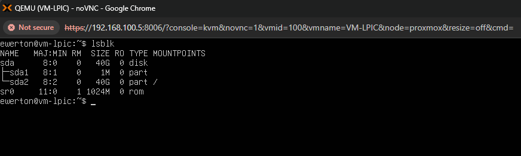
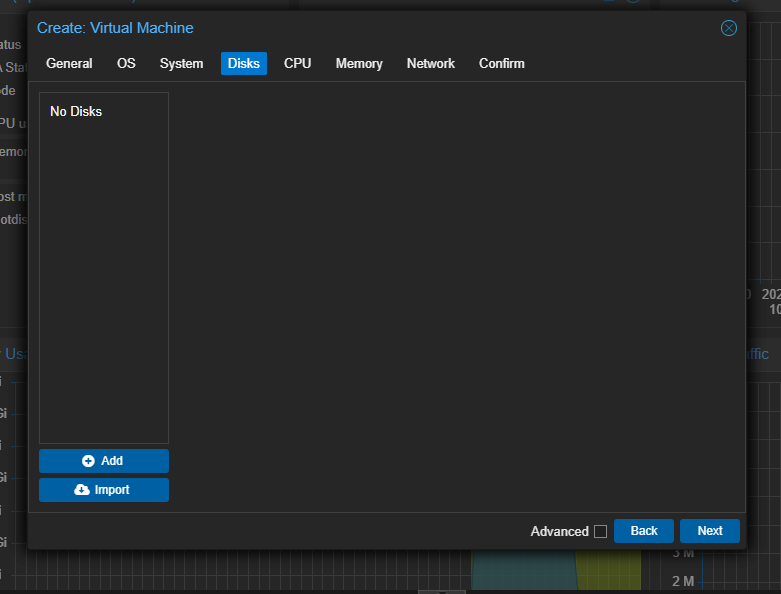
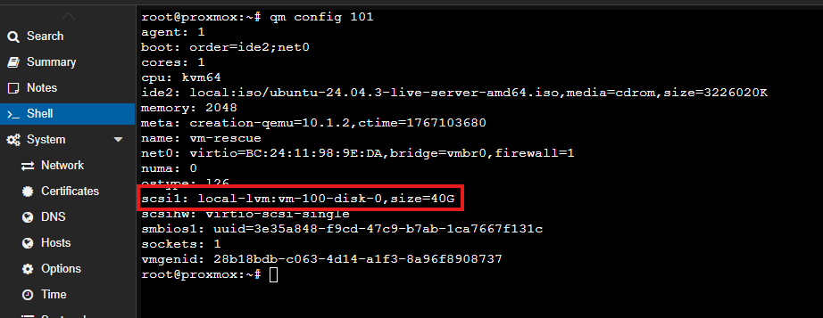
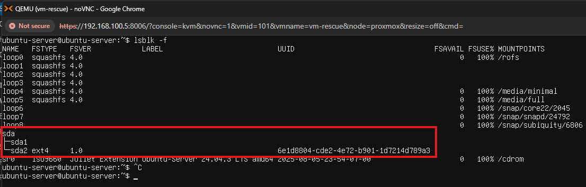
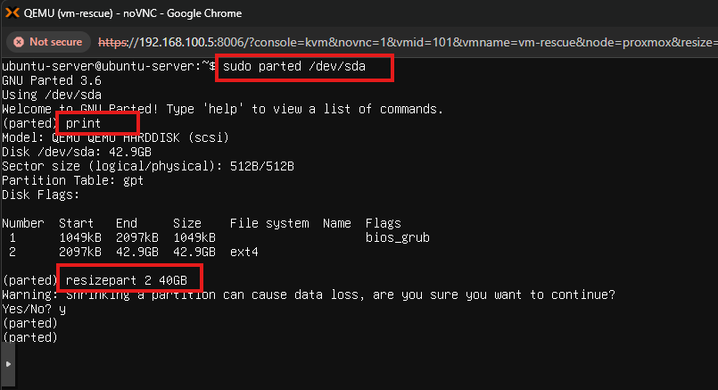
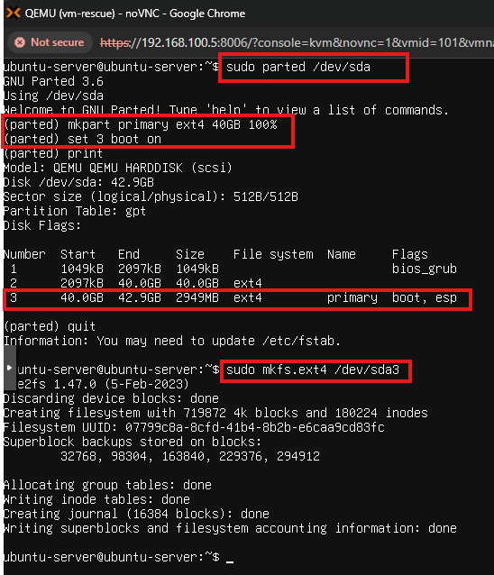
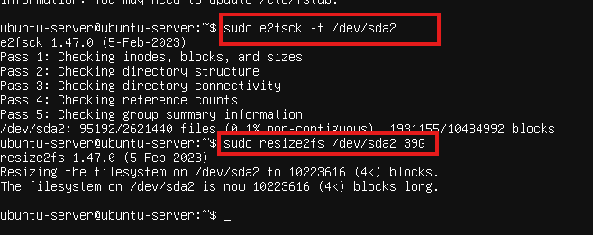
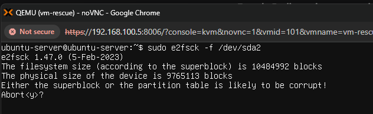
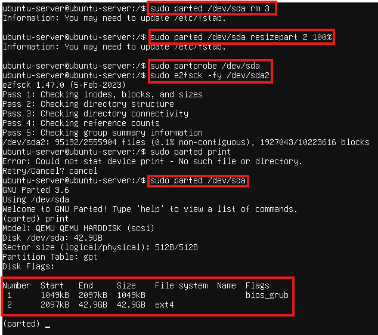
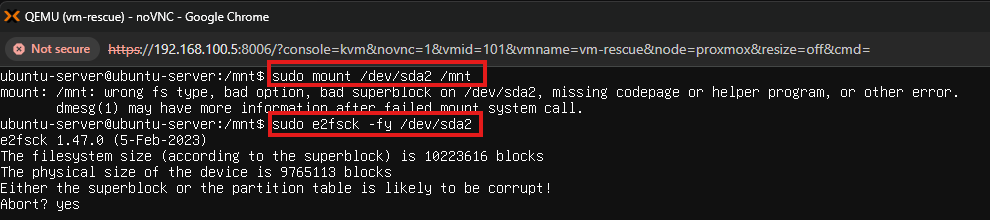

Nesse homelab, será criado uma partição para o /boot, pois na instalação do sistema operacional Linux, não foi feito isso. A não criação foi proposital para que seja utilizado métodos necessários para a criação já com o SO em execução. Para isso, foi necessário a utilização do LIVECD do Linux, que é o sistema sendo executado na memória, mas não está no dispositivo de armazenamento. O virtualizador utilizado para criar a VM foi o Proxmox.

Abaixo, temos a informação do sistema operacional principal e suas partições:

sda1 - Bios_boot 

sda2 - Root filesystem

Pode-se perceber que não existe partição /boot. /boot é apenas um diretório comum dentro do diretório raiz /.

Por que criar uma partição para o /boot?

* Flexibilidade

Caso a partição raiz (/) for criptografada e o boot estiver dentro dele, o sistema não consegue carregar o kernel antes da descriptografia. Agora, se o /boot estiver separado e sem criptografia, GRUB (bootloader) pode carregar os arquivos essenciais.

* Segurança

Se ocorrer alguma corrupção do root filesystem, o /boot separado permite iniciar o sistema em modo recuperação.

* Gerenciamento de Kernels

Permite ter vários kernels instalados sem conflitos.

* Facilidade em Dual-Boot

Em situações com outros sistemas ou partições complexas, igual ZFS em LVM, o /boot compacto e simples (ext4) previne problemas de compatibilidade do bootloader.

* Diminuir complicação

Mantém o processo de inicialização mais simples e otimizado, com tabelas de arquivos menores, diminuindo a pressão sobre a RAM inicial.

Por que durante a instalação eu consigo particionar, mas depois preciso de LIVECD?

* Durante a instalação não está montada como sistema ativo
* O disco não está em uso
* O instalador roda em um ambiente live (RAM)

Ou seja, na pratica, o instalador já é um LIVECD automatizado com o disco totalmente livre para ser alterado. Agora, quando o Linux está instalado e rodando:

* A partição raiz (/) está montada
* O sistema de arquivo está em uso
* Binários, bibliotecas e processos estão acessando o disco
* O kernel bloqueia operações destrutivas em partições montadas

Exemplo:

Não é possível dimensionar, mover ou recriar:

* /
* /boot (se existir)
* Partições ativas

Isso causaria corrupção imediata do filesystem.

Por que especificamente o /boot exige LIVECD?

O /boot contém:

• Kernel (vmlinuz)

• Initramfs

• GRUB

• Mapas de boot

Durante o boot normal:

• O kernel foi carregado a partir do /boot

• O GRUB depende desses arquivos

• O filesystem precisa estar 100% consistente

Então:

Criar /boot separado

Redimensionar partição raiz

Mover blocos no disco

Somente com o sistema desligado, via LIVECD.

Agora, já esclarecido as questões sobre o /boot e filesystem, seguiremos o processo de criação do /boot. Utilizando o Proxmox, foi necessário criar uma outra VM com a imagem ISO do Ubuntu server, porém sem adicionar um disco para ela.

VM criada sem disco, pois será anexado nela a imagem de disco da VM principal, na qual queremos criar a partição SDA3. Com a VM rescue criada e sem disco, será utilizado o shell do node que as VM's estão hospedadas.

Os comandos usado para isso foram os seguintes:

* qm set 101 -scsi1 local-lvm:vm-100-disk-0 - Anexar o disco
* qm set 101 -delete scsi1 - Remover disco, se necessário
* qm config 101 - Ver as configurações

 

Dessa forma, com a VM rescue criada e anexado o disco a VM principal, a VM deve ser iniciada em modo LIVECD  e executado os comandos necessários. Ela será iniciada normalmente com um instalador, clicar em "Try or Install Ubuntu" e quando aparecer a opção de idioma, pressionar Alt+Ctrl+f2 e a máquina entrará em modo LIVECD. A partir disso, pode começar utilizar os comandos.

* lsblk -f - visualizar o disco e partições

Na imagem, é possível ver que os mesmos discos e partições da VM rescue é o da VM principal. Dessa forma, podemos seguir com o processo de particionar o disco. Usaremos os seguintes comandos:

* sudo parted /dev/sda - Utilitário para gerenciar particionamento de discos rígidos.
* print - Visualizar as partições. 
* resizepart 2 40GB - Redimensionar a partição, o dois é informando qual partição e o quarenta é o tamanho solicitado.

Após isso, criaremos a partição e formataremos usando os seguintes comandos:

CRIAÇÃO
* sudo parted /dev/das
* mkpart primary ext4 40GB 100%
* set 3 boot on 
* print 

FORMATAÇÃO

*sudo mkfs.ext4 /dev/sda3

Agora, será feito o reajuste do filesystem.

* sudo e2fsck -f /dev/sda2 - Verificar integridade 
* sudo resize2fs /dev/sd2 39G - Redimensionar o filesystem 

Depois de todo esse processo, é preciso montar o root filesystem e fazer as devidas configurações para tornar a nova partição bootável.  Entretanto, ocorreu um erro de integridade do root filesystem que não me permitiu montar a partição. Não foi tirado print do erro, mas basicamente, devido a ordem errada do processo, causou essa falha. Na criação de uma nova partição a onde se faz necessário o redimensionamento de uma outra partição, o processo é redimensionar o filesystem e depois redimensionar a partição.  O sistema de arquivos (como NTFS, ext4, etc.) gerencia onde os dados estão localizados dentro do espaço de armazenamento. Ele tem metadados que descrevem a estrutura e a localização dos arquivos. Se você diminuir a partição (o contêiner físico ou lógico) primeiro, sem reduzir o sistema de arquivos, a nova borda da partição pode cortar o meio dos dados existentes.  Isso torna o sistema de arquivos quebrado e inutilizável, resultando em perda de dados.Ao diminuir o sistema de arquivos primeiro, a ferramenta move todos os dados para o início do espaço disponível e ajusta a estrutura de dados (metadados) para refletir o novo tamanho menor.  Isso garante que todos os dados permaneçam intactos e acessíveis antes que o contêiner subjacente seja reduzido para corresponder.  Por algum motivo não identificado, o reajuste com "sudo e2fsck -f" e "sudo resize2fs' foi bem sucedido, mesmo fazendo o processo de forma ao contrária, porque o "e2fsck" não valida limites físicos da partição, ele valida:
-superblock
-bitmap
-inode tables
-links
-contadores

Se os metodos ainda estiverem coerentes entre si, ele pode finalizar sem erro, marcar problemas como corrigos e não perceber imediatamente que o final do fs foi truncado. 

Por que os erros só apareceram depois (mount, size mismatch, etc)?

Porque:
-O ext4 grava metadados ao longo do disco

-Algumas estruturas (journals, backup superblocks) ficam:
---no final do filesystem ou em posições fixas relativas ao tamanho antigo

-Quando o kernel tenta montar:
---Ele lê superblocks secundários
---Ele confere tamanho esperado × device real

-Aí surgem mensagens tipo:
---filesystem size mismatch
---bad superblock
---journal error
---mount: wrong fs type or bad option

Ou seja:

o problema já estava lá, só ainda não tinha sido “ativado”.

Agora, tentando utilizar o "e2fsck" ele começa a dar erro, pois o comando já começou a localizar as falhas. 

Foi feito um novo redimensionamento, excluído a nova partição (SDA3) e crescendo a partição root (SDA2) para o tamanho original e feito a verificação de integridade. 

Realizado todo o processo novamente, mas na ordem correta, reajuste de filesystem, redimensionamento da partição SDA2 e criação e formatação da partição SDA3. Porém o erro na hora montagem do root filesystem o problema persistiu 

