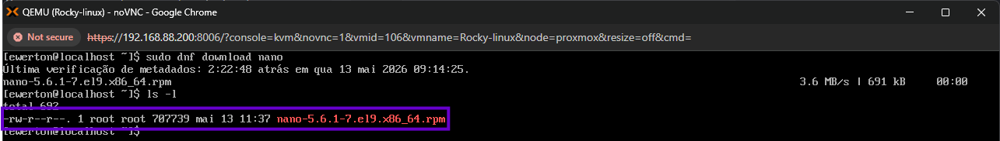
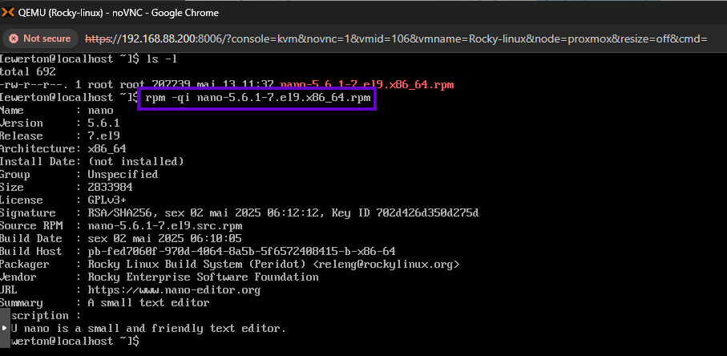
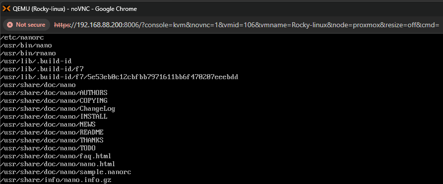
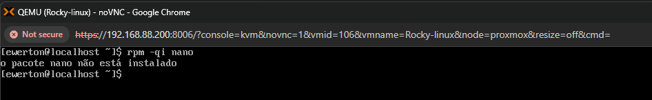
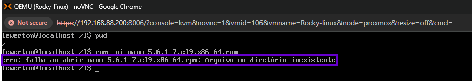
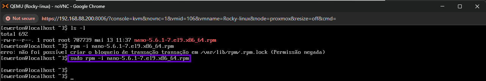
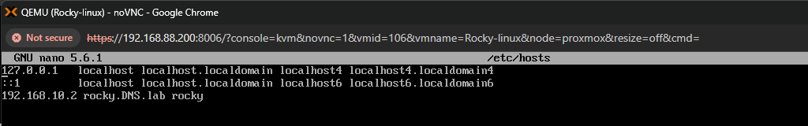
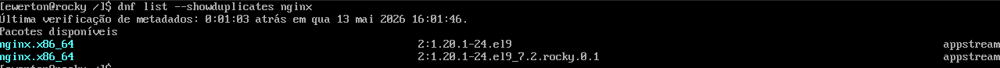

Laboratório: Gerenciando pacotes com RPM

Neste Laboratório será utilziado a ferramente de gerenciamento de pacotes RPM.

Conceitos fundamentais: O gerenciador de pacote RPM é o equivalente funcional do DPKG. ambas as ferramentas são de baixo nível, porém usadas em base de sistemas diferentes. 

 1. Baixando pacote com DNF 
 
Como o gerenciador RPM é uma ferramenta de baixo nível, ele só consegue gerenciar pacotes já pertencentes ao sistema. Para isso, será utilizado uma outra ferramenta de gerenciamento de pacotes,
que é o DNF. Essa ferramenta ela é de alto nível, podendo também instalar, gerenciar, remover e também pode resolver dependências do pacote que está sendo baixo. A resolução de dependências
não se aplica ao RPM. Nesse caso, é necessário baixar o pacote .rpm, mas não instalar. Para isso, dentro do diretório /home/ewerton, será utilizado o comando:
 
* sudo dnf download nano
 

 
Após o download, utilizando o comando ls -l é possível visualizar o pacote .rpm baixado no diretório /home/ewerton. 
 
  2. Obtendo informaçõe do pacote 
  
Agora com o pacote baixa no sistema, é possível fazer os devidos gerenciamento. Agora, será depurado as informações desse pacote, antes mesmo dele ser instalado na máquina.

* rpm -qi [pacote]

Na imagem é possível observar informações sobre o pacote como versão, arquitetura, data de instalação, packager, etc. 

É possível também obter informações sobre quais arquivos serão instalados no sistema e a onde eles serão instalados. Para isso, usa-se o comando:

* rpm ql [pacote]

 

Na imagem, de forma padronizada, é fornecido a informações de onde cada arquivo será armazenado. 

Observações: O RPM tem o parâmetro -p que é utilizado para consultar e ler os arquivos não instalados no sistema. Porém como visto nas imagens anteriores, o pacote nano não se encontra
instalado no sistema e mesmo assim sem o parâmetro -p ele consulta o arquivo e trás informações sobre ele, isso tem um motivo lógico para acontecer. O RPM tem um atalho inteligente,
e como isso funciona? Nos comandos anteriores que foram utilizados, foram utilizados dentro de /home/ewerton. Caso os comandos fossem utiizados fora desse diretório na qual o arquivo
.rmp está instalado, seria necessário usar o comando e passar o caminho. Por exemplo se estivesse no diretório raiz:

* rpm -qi /home/ewerton/[pacote]
* rpm -ql /home/ewerton/[pacote]

Agora voltando para o fornecimento de informações do arquivo mesmo sem o parâmetro -p. Primeiramente, o RPM consulta dois lugares diferentes. Esses lugares são:

1. O banco de dados dos pacotes instalados no sistema 
2. Um arquivo .rpm solto no disco

O parâmetro -p serve para dizer: “não olha os pacotes instalados, olha esse ARQUIVO RPM aqui”.

E é aqui que entra o atalho inteligente. Mesmo sem -p, os comandos anteriores funcionaram porque estavam sendo executados DENTRO de /home/ewerton e passado o nome inteiro 
do arquivo. O RPM olha esse nome inteiro e mesmo sem o -p entende "isso é um arquivo .rpm, vou consultar e obter as informações". Agora testando sem passar o nome inteiro do arquivo o 
resultado será:

 

Isso ocorre em detrimento do pacote nano não está na base de dados de pacotes instalados. Veja que é o mesmo comando, porém solicitando a verificação do pacote na base de dados.
Quando é utilizado toda a extensão do arquivo (nano-5.6.1-7.el9.x86_64.rpm) o RPM entende que é um arquivo .rpm e consulta ele. 

Outro teste que pode ser feito também, é utilizar o comando passando todo a extensão do arquivo, mas fora de /home/ewerton. O resultado será:

 

O RPM não conseguiu mapear esse arquivo, mesmo passando toda a extensão, pois o shell entregou para o RPM apenas /nano-5.6.1-7.el9.x86_64.rpm e não /home/ewerton/nano-5.6.1-7.el9.x86_64.rpm
Para que fora, do /home/ewerton o RPM consiga mapear e extrai informações, é necessário passar o caminho completo:

 

Ou seja, o parâmetro -p nesse deve ser utilizado porque deixa explícito a intenção, evita ambiguidades, funciona de forma previsível, e é o padrão esperado em scripts e documentação técnica.

 3. Instalando, atualizando e removendo pacotes com RPM
 
Uma das operações mais básicas é instalar, atualizar pacotes do sistema. Com o arquivo nano localizado em /home/ewerton, é possível executar o comando de instalação do nano.
Como informando no tópico anterior, é possível executar o RPM estando dentro do diretório que possui o arquivo ou de fora do diretório, mas passando o caminho completo. Nesse caso,
Será executado dentro do diretório /home/ewerton.

* sudo rpm -i nano 

Conforme a imagem, o primeiro ocorreu devido a falta de privilégio para que o rpm posso escrever em arquivos. Porém após o sudo tudo foi executado corretamente, nenhuma mensagem 
de erro impressa na tela. Agora, testando o nano, o resultado é:

Editor de arquivo funcionando normalmente. 

Agora, será feito a atualização de um pacote utilizando o RPM, e o pacote que será manipulado será o nginx, pois o nano só possui uma versão no repositório da Rocky linux.
Caso o sistema tenha uma nova versão de um pacote, é possível utilizar o parâmetro -U, mas para isso, é necessário que a nova versão esteja baixada manualmente também. 
Para ver quais são as versões disponíveis, se usa o comando:

* dnf list --showduplicates nano

