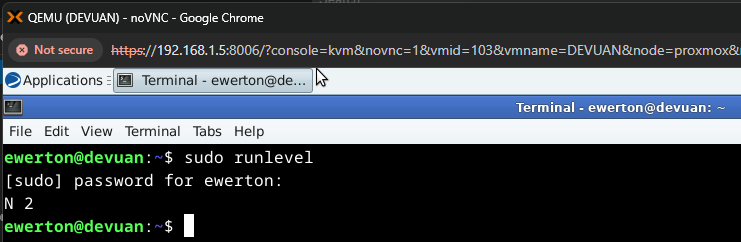

Laboratório: Desabilitar a interface gráfica Devuan

Esse laboratório descreve o processo e analise de como funciona o SystemV init e seus runlevels. 

 1. Conceitos fundamentais: O systemV é o primeiro processo (PID 1) executado e atráves dele os demais processos e serviços são executados e gerenciados. Quando o Kernel invoca o programa localizado em /sbin/init, o systemV localiza o diretório /etc/inittab e executa os scripts ali descritos. Esse script define qual runlevel será utilizado e seus serviços necessários. Runlevels resumidamente são estados operacionais (iniciando, multusuário, gráfico, etc.) do sistema. Eles agrupam serviços para definir o que carrega, sendo númerados de 0 a 6 e através de links simbólicos, oferecem mais flexibilidade para organizar a inicialização e os serviços.

Para visualizar o contéudo dentro de /etc/inittab utiliza-se o comando:

* sudo nano /etc/inittab ou cat /etc/inittab

 

 2. Análise e entendimento da saída nano/cat. Com base na execução do comando, identificamos as seguintes syntaxe:

id:2:initdefault: - Informa ao systemv qual será o runlevel padrão atual.

si::sysinit:/etc/init.d/rc2 - O rcS serve como o primeiro script de controle executado pelo processo init. Sendo responsável por configurar o ambiente básico antes que o usuário possa interagir com o sistema.

12:2:wait:/etc/init/rc 2 - rc 2 é o runlevel na qual vai ser executado seus arquivos de serviços que definem o ambiente. 

Quando o systemV olha para o /etc/init/rc 2, ele entende que deve ir até o diretório /etc/rc2.d e executar os scripts ali encontrados. Mas essa execução não é deliberada, existe ordens do que "matar" e do que deve iniciar. Com o comando:

* ls -l /etc | grep rc

É possível ver todos os runlevels e dentro deles possuem os arquivos de serviços necessários para ambiente, definido pelo administrador .

rc2.d (Runlevel atual):

Dentro de rc2.d é possível visualizar todos os arquivos de serviço. Pode-se perceber que o nome dos arquivos começam com K (kill)e depois mudam para S (Start). Isso significa que o systemV identifica primeiro os serviços que NÃO devem ser executados e depois os que devem inicializar. Esses arquivos também segue uma ordem de numeração, qual é do menor para o maior. Por exemplo a ordem do rc2.d começa com 01, 02, 03, 04 e 05. Mas um ponto muito importante desses arquivos é que todos eles são links simbólicos. Esses links simbólicos direcionam o sistema para o arquivo de serviço real, que fica localizado em /etc/init.d/*.

 3. Identificando runlevel atual:

* sudo runlevel

A sáida do comando informa que o runlevel atual é o 2, conforme descrito também na syntaxe do /etc/inittab. 

 4. Aletrando runlevel atual:

* sudo init 3

